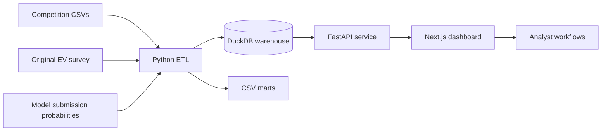

# EV Buyer Intelligence


An end-to-end data and machine-learning portfolio project that turns EV adoption data into buyer scoring, market intelligence, data-quality monitoring, and policy scenario planning.

The project began as a Kaggle binary-classification workflow and evolved into a product-style analytics platform. It demonstrates the full path from raw CSV ingestion and model experimentation to warehouse marts, API contracts, responsive dashboard experiences, and a documented cloud migration architecture.


## Table of Contents

- [What the Platform Does](#what-the-platform-does)
- [Key Results](#key-results)
- [Architecture](#architecture)
- [Application Pages](#application-pages)
- [Data Pipeline](#data-pipeline)
- [Warehouse Model](#warehouse-model)
- [Machine-Learning Methodology](#machine-learning-methodology)
- [API Reference](#api-reference)
- [Repository Structure](#repository-structure)
- [Local Setup](#local-setup)
- [Configuration](#configuration)
- [Verification](#verification)
- [Cloud Deployment Blueprint](#cloud-deployment-blueprint)
- [Design Decisions and Limitations](#design-decisions-and-limitations)
- [Roadmap](#roadmap)

## What the Platform Does

EV Buyer Intelligence is designed as an internal growth and strategy workspace for exploring EV purchase intent. It supports several connected workflows:

- Scores 286,571 competition test profiles using the best available local model submission.
- Organizes probabilities into `Low`, `Watch`, `High`, and `Priority` adoption bands.
- Ranks buyer segments by average purchase probability and lift over the population average.
- Compares the current competition population with a 10,000-row historical EV adoption reference dataset.
- Estimates directional lift from subsidy, charging-access, and range-anxiety interventions.
- Monitors missingness, row counts, uniqueness, and feature coverage across pipeline layers.
- Provides an interactive, explainable profile simulator for scenario exploration.
- Presents the work through a custom responsive interface rather than a notebook-only or Streamlit demonstration.

## Key Results

The underlying Kaggle task predicts `Will_Buy_EV` and is evaluated with ROC AUC. Validation used five-fold stratified cross-validation so every out-of-fold prediction came from a model that did not train on that row.

| Experiment | Validation result |
|---|---:|
| Logistic regression | 0.938106 OOF AUC |
| XGBoost baseline | 0.941804 OOF AUC |
| Tuned XGBoost | 0.941825 OOF AUC |
| LightGBM | 0.941836 OOF AUC |
| Native-categorical LightGBM | 0.941897 OOF AUC |
| LightGBM with original rows | 0.941882 OOF AUC |
| Original-prior target encoding | 0.941852 OOF AUC |
| LightGBM and XGBoost blend | **0.941928 OOF AUC** |

The strongest submitted TabM run reached a public leaderboard score of **0.94480**, improving substantially over the earlier tree submissions. The experiment history is preserved in [`kaggle_competition_workspace/docs/project_writeup.md`](kaggle_competition_workspace/docs/project_writeup.md).

Two findings shaped the product design:

1. Directly appending original-dataset rows did not improve honest validation.
2. Using original-category rates as Bayesian target-encoding priors also did not improve validation.

The original data is therefore used as a historical comparison and governance asset, not presented as a proven training boost.

## Architecture



The local implementation mirrors a production analytics stack while remaining inexpensive and reproducible:

| Layer | Local implementation | Production analogue |
|---|---|---|
| Raw | CSV files | Amazon S3 raw zone |
| Transformation | Pandas ETL | AWS Glue, ECS task, or dbt |
| Warehouse | DuckDB | Snowflake staging and mart schemas |
| Serving | FastAPI | ECS/Fargate or Lambda and API Gateway |
| Product | Next.js | Vercel or AWS Amplify/CloudFront |
| Observability | Console validation output | CloudWatch and warehouse monitoring |

## Application Pages

| Route | Purpose |
|---|---|
| `/home` | Cinematic product landing page and platform workflow overview |
| `/` | Executive adoption command center with KPIs, policy opportunities, and vehicle-class signals |
| `/live-scoring` | Operational view of scored profiles, batch composition, refresh cadence, and intent bands |
| `/segments` | Segment ranking by buyer profile, city/charging context, subsidy/anxiety context, or vehicle type |
| `/market-dna` | Original-versus-current population drift and plain-language findings |
| `/simulator` | Interactive profile scoring and intervention comparison |
| `/model` | Model progression, validation story, experiment history, and governance flow |
| `/data-quality` | Dataset health, feature-level missingness, and important exceptions |

The UI uses Next.js App Router, React 19, TypeScript, Recharts, Motion, Lucide icons, and generated unbranded vehicle imagery. It includes loading and API-error states, responsive navigation, keyboard focus styles, reduced-motion support, and desktop/mobile layouts.

## Data Pipeline

The pipeline in [`ev_adoption_platform/etl/build_warehouse.py`](ev_adoption_platform/etl/build_warehouse.py) performs the following steps:

1. Finds the competition train, competition test, and original EV adoption CSVs.
2. Renames the original `Buyer_ID` field to `id` and maps `Will_Buy_EV` from `Yes`/`No` to `1`/`0`.
3. Aligns both sources to a common set of 13 modeling features.
4. Adds interpretable derived features:
   - total charging access
   - home-versus-work charging gap
   - charging access per commute kilometre
   - income per owned car
   - binary home-charging, subsidy, and high-anxiety indicators
   - city/home-charging and subsidy/anxiety segments
   - combined buyer segment
5. Selects the strongest available prediction file using a documented precedence order.
6. Verifies that every test `id` has a model probability.
7. Creates adoption bands and a high-intent indicator.
8. Builds segment, policy, drift, quality, and overview marts.
9. Writes each table to DuckDB and exports a matching CSV mart.

### Required Local Data

Raw data is intentionally excluded from Git. Place files at these paths:

```text
kaggle_competition_workspace/data/train.csv
kaggle_competition_workspace/data/test.csv
kaggle_competition_workspace/data/OG Dataset/EV_Adoption_and_Range_Anxiety_Dataset.csv
```

Expected source shapes:

| File | Rows | Columns |
|---|---:|---:|
| `train.csv` | 668,665 | 15 |
| `test.csv` | 286,571 | 14 |
| Original EV reference | 10,000 | 15 |

The competition target rate is approximately 17.46%. The source includes seven numeric features and six categoricals covering demographics, income, commuting, charging access, current vehicle class, environmental concern, subsidies, and range anxiety.

### Prediction File Selection

The ETL searches the repository root and the archived submission folders in this order:

```text
submission_tabm_rank_average.csv
submission_tabm_colab.csv
submission_chris_lgbm_tuned_blend.csv
submission_chris_plus_lgbm_blend.csv
submission_chris_xgb_starter_reproduction.csv
submission_equal_blend.csv
```

The selected file must contain `id` and `Will_Buy_EV`, cover every test ID, and provide valid probability values. The ETL joins scores to profiles by `id`, so file row order is not relied upon.

## Warehouse Model

Running the ETL creates `ev_adoption_platform/warehouse/ev_adoption.duckdb` plus CSV copies under `warehouse/marts/`.

| Table | Grain and purpose |
|---|---|
| `historical_adoption` | One row per original survey respondent, normalized for historical comparison |
| `training_reference` | One row per competition training profile with target and engineered features |
| `scored_current_customers` | One row per test profile with model probability, score source, adoption band, and intent flag |
| `mart_segment_metrics` | One row per category within each supported segment type |
| `mart_policy_simulation` | One row per intervention scenario with affected population and directional probability lift |
| `mart_data_quality` | One row per dataset and column with row count, missingness, and cardinality |
| `mart_drift_metrics` | One row per feature with numeric mean difference or categorical distribution distance |
| `mart_overview_metrics` | One row per headline dashboard KPI |

The Snowflake equivalents are defined in [`ev_adoption_platform/sql/snowflake_marts.sql`](ev_adoption_platform/sql/snowflake_marts.sql).

## Machine-Learning Methodology

The archived workspace documents a deliberately iterative modeling process:

- Logistic regression established a linear baseline.
- XGBoost and LightGBM captured nonlinear interactions and became the strongest tree models.
- Native categorical LightGBM avoided one-hot expansion and slightly improved OOF AUC.
- CatBoost provided another categorical-tree baseline but did not lead the final validation result.
- Original-row augmentation and original-prior target encoding were evaluated with leakage-safe folds and rejected after negative deltas.
- Equal, weighted, rank, and stacked blends were tested; only modestly decorrelated models helped.
- TabM introduced a genuinely different neural representation and produced the largest leaderboard improvement.

All central comparisons use `StratifiedKFold(n_splits=5, shuffle=True, random_state=42)` and ROC AUC on competition OOF rows. Original reference rows never enter competition validation folds.

The dashboard consumes saved model probabilities instead of retraining at request time. The `/predict` simulator is intentionally a transparent logistic scenario formula for interactive product exploration. It is not the serialized TabM competition model and should not be interpreted as production underwriting or individual-level advice.

## API Reference

Start FastAPI and open `http://127.0.0.1:8000/docs` for the interactive OpenAPI interface.

| Method | Endpoint | Description |
|---|---|---|
| `GET` | `/health` | API and warehouse readiness |
| `GET` | `/metrics/overview` | Headline adoption KPIs |
| `GET` | `/segments?segment_type=buyer_segment&limit=12` | Ranked segment metrics |
| `GET` | `/customers?band=Priority&limit=100` | Highest-scoring customer profiles, optionally filtered by band |
| `GET` | `/data-quality?dataset=competition_train` | Column-level quality metrics |
| `GET` | `/drift` | Original-versus-competition feature drift |
| `GET` | `/policy-simulation` | Directional intervention scenarios |
| `GET` | `/live-feed?limit=8` | Rotating slice of previously scored profiles |
| `POST` | `/predict` | Explainable interactive profile simulation |

Example simulator request:

```powershell
$body = @{
  age = 35
  annual_income_usd = 90000
  daily_commute_km = 25
  number_of_cars_owned = 1
  charging_stations_near_home = 3
  charging_stations_near_work = 4
  environmental_concern_level = 7
  city_type = "Urban"
  current_car_type = "Sedan"
  home_charging_possible = "Yes"
  subsidy_available = "Yes"
  range_anxiety_level = "Low"
} | ConvertTo-Json

Invoke-RestMethod `
  -Method Post `
  -Uri http://127.0.0.1:8000/predict `
  -ContentType application/json `
  -Body $body
```

## Repository Structure

```text
.
|-- ev_adoption_platform/
|   |-- api/main.py                  # FastAPI service
|   |-- cloud/                       # AWS CDK, batch image, tests, operations
|   |-- etl/build_warehouse.py       # ingestion, validation, marts
|   |-- frontend/
|   |   |-- app/                     # Next.js routes and global styles
|   |   |-- components/              # shell, views, and visual components
|   |   |-- lib/                     # API types, client, and site config
|   |   `-- public/images/           # generated unbranded vehicle assets
|   |-- infra/                       # AWS and Snowflake blueprint
|   |-- sql/                         # warehouse view definitions
|   `-- warehouse/                   # generated locally, ignored by Git
|-- kaggle_competition_workspace/
|   |-- configs_and_results/         # compact experiment outputs
|   |-- docs/project_writeup.md      # detailed modeling narrative
|   |-- notebooks/                   # project-authored Colab TabM notebooks
|   |-- scripts/                     # training, tuning, encoding, blending
|   |-- data/                        # local raw data, ignored by Git
|   |-- oof_predictions/             # generated predictions, ignored by Git
|   `-- submissions/                 # generated submissions, ignored by Git
|-- AGENTS.md                        # contributor guidance
`-- README.md
```

## Local Setup

### Prerequisites

- Python 3.10 or newer
- Node.js 20 or newer
- npm
- The three source CSVs listed above
- At least one supported model submission file

### 1. Clone and Create the Python Environment

```powershell
git clone https://github.com/Atharva2102/ev-buyer-intelligence.git
cd ev-buyer-intelligence\ev_adoption_platform
python -m venv .venv
.\.venv\Scripts\Activate.ps1
python -m pip install --upgrade pip
pip install -r requirements.txt
```

On macOS or Linux, activate the environment with `source .venv/bin/activate`.

### 2. Add Local Data and Scores

Create the data paths shown in [Required Local Data](#required-local-data), then place a supported submission CSV in the repository root or `kaggle_competition_workspace/submissions/top_10/`.

### 3. Build the Warehouse

From `ev_adoption_platform/`:

```powershell
python etl\build_warehouse.py
```

The command prints the selected source files, missing source columns, chosen score file, and row count for every generated table. A successful run ends with the DuckDB warehouse path.

### 4. Start the API

```powershell
python -m uvicorn api.main:app --reload --port 8000
```

Verify it:

```powershell
Invoke-RestMethod http://127.0.0.1:8000/health
```

### 5. Start the Frontend

In a second terminal:

```powershell
cd ev_adoption_platform\frontend
npm install
npm run dev
```

Open:

- Product site: `http://localhost:3000/home`
- Analytics workspace: `http://localhost:3000`
- API documentation: `http://127.0.0.1:8000/docs`

## Configuration

The frontend uses `http://localhost:8000` by default. Override it for a deployed API:

```powershell
$env:NEXT_PUBLIC_API_BASE = "https://api.example.com"
npm run build
```

GitHub and LinkedIn links are centralized in [`ev_adoption_platform/frontend/lib/site.ts`](ev_adoption_platform/frontend/lib/site.ts). Replace the placeholder values before a public deployment.

FastAPI currently allows browser requests from `http://localhost:3000` and `http://127.0.0.1:3000`. Add the production frontend origin to `allow_origins` when deploying.

## Verification

Build and type-check the frontend:

```powershell
cd ev_adoption_platform\frontend
npm run build
```

Smoke-test the core services:

```powershell
Invoke-RestMethod http://127.0.0.1:8000/health
Invoke-WebRequest http://localhost:3000/home -UseBasicParsing
Invoke-WebRequest http://localhost:3000/simulator -UseBasicParsing
```

Recommended checks after changing data or models:

- Confirm every test ID receives exactly one score.
- Confirm probabilities remain between `0` and `1`.
- Compare warehouse row counts with source row counts.
- Inspect missingness and drift marts for unexpected changes.
- Verify segment rankings and policy totals after rebuilding.
- Test all routes at desktop and mobile widths.
- Exercise simulator submission, segment switching, refresh controls, keyboard focus, and reduced-motion mode.

There is not yet a formal automated test suite. Production hardening should add pytest coverage for ETL contracts and API responses plus browser tests for route rendering and interactions.

## Cloud Deployment Blueprint

The repository includes deployable AWS CDK and container code in [`ev_adoption_platform/cloud/`](ev_adoption_platform/cloud/README.md), plus the broader AWS and Snowflake mapping in [`ev_adoption_platform/infra/aws_snowflake_blueprint.md`](ev_adoption_platform/infra/aws_snowflake_blueprint.md):

1. Validate and land immutable source files in an encrypted, versioned S3 `raw/` prefix.
2. Trigger the containerized ECS Fargate task manually or through its disabled-by-default EventBridge rule.
3. Normalize and validate data into staging tables or curated Parquet.
4. Materialize analyst-facing marts in Snowflake.
5. Publish scored profiles into a serving schema.
6. Host FastAPI on ECS/Fargate or behind API Gateway.
7. Deploy Next.js through Amplify, CloudFront, or Vercel.
8. Send pipeline logs to CloudWatch and write timestamped success/failure manifests to S3.

This separation keeps the dashboard independent from notebooks and raw files, matching the ownership boundaries of a production data product.

## Design Decisions and Limitations

- **No manufacturer claims:** the datasets contain vehicle classes, not Tesla, Rivian, or other brands. All vehicle imagery is generated and unbranded.
- **Historical reference, not causal evidence:** the original dataset supports drift and quality analysis. Negative augmentation experiments are retained as model-governance evidence.
- **Directional policy estimates:** policy scenarios apply fixed log-odds adjustments to existing probabilities. They are useful for prioritization demonstrations, not causal impact estimates.
- **Transparent simulator:** the interactive scorer is an explainable formula and not the trained TabM artifact.
- **Operational demo feed:** `/live-feed` rotates through already scored warehouse rows every five seconds. It demonstrates serving and monitoring UX but is not Kafka, Kinesis, or true event streaming.
- **Local warehouse:** DuckDB is ideal for reproducibility and portfolio review, but concurrent production workloads should use a managed warehouse or transactional serving store.
- **Data is excluded:** Kaggle files, OOF predictions, submissions, and generated warehouse artifacts are not committed because they are large and rebuildable.
- **No authentication:** the current API and dashboard are intended for local demonstration. A deployed version needs identity, authorization, rate limiting, and secrets management.

## Roadmap

- Package and version a trained inference artifact so the simulator and batch scores share one model.
- Add pytest schema and API contract tests.
- Add Playwright route and interaction tests to CI.
- Containerize ETL, FastAPI, and Next.js services.
- Deploy raw and curated zones to S3 and marts to Snowflake.
- Add scheduled scoring, model-version metadata, and pipeline run history.
- Replace fixed policy adjustments with causal or uplift modeling where suitable data exists.
- Add authentication and role-aware views for analysts, operators, and strategy users.
- Publish architecture diagrams, application screenshots, and a live hosted demo.

## Further Reading

- [Application architecture and local workflow](ev_adoption_platform/README.md)
- [AWS and Snowflake blueprint](ev_adoption_platform/infra/aws_snowflake_blueprint.md)
- [Deployable cloud pipeline](ev_adoption_platform/cloud/README.md)
- [Snowflake mart definitions](ev_adoption_platform/sql/snowflake_marts.sql)
- [Full modeling write-up](kaggle_competition_workspace/docs/project_writeup.md)
- [Kaggle workspace guide](kaggle_competition_workspace/README.md)

## Responsible Use

This repository is an educational portfolio project built from synthetic competition data and a public reference dataset. Its scores should not be used for credit, insurance, employment, eligibility, or other high-impact decisions.
